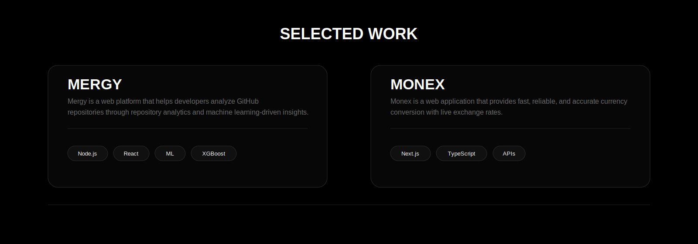

## Selected Work

## Stack

## Overview

## Connect

<a href="https://github.com/AarjanAdhikari">GitHub</a>
&nbsp;&nbsp;·&nbsp;&nbsp;
<a href="https://YOUR-WEBSITE.COM">Website</a>
&nbsp;&nbsp;·&nbsp;&nbsp;
<a href="https://linkedin.com/in/YOUR-LINKEDIN">LinkedIn</a>
&nbsp;&nbsp;·&nbsp;&nbsp;
<a href="mailto:YOUR_EMAIL">Email</a>

